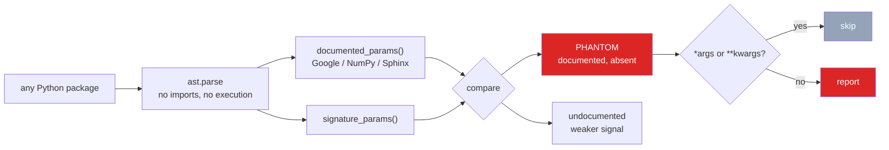

<h1 align="center">docstring-drift (Python · stdlib AST · static analysis)</h1>
<p align="center"><i>Documentation that quietly stopped being true</i></p>

<p align="center">
  <a href="docs/RESULTS.md">Results</a> ·
  <a href="docs/METHOD.md">Method</a> ·
  <a href="docs/PROBLEMS.md">Problems hit</a> ·
  <a href="docs/LIMITATIONS.md">Limitations</a> ·
  <a href="docs/FUTURE.md">Future work</a> ·
  <a href="#use-it">Use it</a>
</p>

<p align="center">
  <a href="https://github.com/hammasbuilds/docstring-drift/actions/workflows/ci.yml"></a>
  <a href="LICENSE"></a>
  
  
  
  <a href="https://github.com/astral-sh/ruff"></a>
</p>

---

> ### 517 documented parameters across 161 Python packages do not exist on the function they describe — 1.93% of every function that documents its parameters.

Rename a parameter and nothing fails. No test breaks, no linter complains, no type checker
objects — the docstring simply keeps describing a function that no longer exists.

This compares what a docstring **claims** the parameters are against what the signature
**actually says**. Pure AST: no imports, no execution, no model, no network.

**This number replaces an earlier one, and it is lower on purpose.** The first
version reported 101 phantom parameters across eight libraries. Scanning 161
packages instead of eight raised the count to 956 — and then reading the
findings showed that **53% of them were not parameters at all**. The six
most-reported "documented parameters" in the whole corpus were docstring
section headers:

```
 84  Returns        49  Examples      21  Shape
 59  Example        25  See            8  Inputs
```

Three bugs caused it. The section-header pattern only matched a header alone
on its line, so `Returns: the loss value` fell through and was recorded as a
parameter. Seven common headers — `Definitions`, `Requirements`, `Relations`,
`Shape`, `Inputs`, `Outputs` and singular `Warning` — were missing from the
list entirely. And a URL in a description parsed as a parameter, because
`https` is a word followed by a colon.

Fixed, the same 161 packages give **517**. Every one of the three bugs is now
a test using the string that caused it.

---

## The result

| Package | functions | documenting params | **phantom** |
|---|---:|---:|---:|
| transformers | 35,432 | 2,740 | **105** |
| torch | 42,608 | 2,183 | **105** |
| sympy | 35,561 | 1,361 | **52** |
| networkx | 7,207 | 1,076 | **49** |
| pandas | 28,295 | 1,631 | **40** |
| scipy | 24,004 | 1,872 | **19** |
| fontTools | 5,524 | 155 | **12** |
| rich | 912 | 265 | **10** |
| websockets · scikit-learn · sentence-transformers | 13,448 | 1,965 | **27** |
| numpy | 11,215 | 732 | **8** |
| 151 others | 122,626 | 12,876 | **90** |
| **161 packages** | **326,832** | **26,856** | **517** |

**45 of 161 packages carry at least one.** The rest are clean, which is the
other half of the result: this is not a rate that applies everywhere.

**Phantom rate: 1.40%** of every function that documents its parameters.

📊 **[Full results, per-package breakdown, and a verified example →](docs/RESULTS.md)**

---

## A real one, from pandas

```python
def round_trip_pickle(obj, tmp_path):          # parameter is tmp_path
    """
    Parameters
    ----------
    path : str, path object or file-like object, default None    # documents `path`
        The path where the pickled object is written and then read.
    """
```

The parameter was renamed. The docstring was not. Nothing in the toolchain noticed.

---

## How it works



🔍 **[How the parsing and comparison actually work →](docs/METHOD.md)**

---

## Use it

```bash
python src/drift.py <path>      # scan any directory of Python
pytest -q                       # 20 tests, no network
```

It works as a CI check: **no dependencies beyond the standard library**, it imports
nothing from the code it scans, and it exits deterministically.

---

## Input

Point it at any directory of Python. Here, an installed `numpy`.


## Output


*`genfromtxt` documents `skiprows` and `missing`. Neither is a parameter. The docstring
even states that `skiprows` was removed in numpy 1.10 — and still lists it.*

---

## The numbers were wrong the first time

The first version reported **~400 phantom parameters in scipy alone**, and almost none
were real. Prose like `Default: None` inside a description was being parsed as a parameter
named `Default`.

After fixing that and two other false-positive classes, **scipy went 434 → 27**. Every
class now has a regression test, and one finding was verified by hand against real source
before any number was published.

🛠 **[Every problem hit while building this, and how each was fixed →](docs/PROBLEMS.md)**

---

## Also worth reading

| | |
|---|---|
| ⚠️ **[Limitations](docs/LIMITATIONS.md)** | What it deliberately does not detect, and why precision was chosen over recall |
| 🚀 **[Future work](docs/FUTURE.md)** | Type checking, stale descriptions, `**kwargs` recall, pre-commit hook |
| 📐 **[Method](docs/METHOD.md)** | Docstring styles supported, normalisation, comparison rules |

---

## Layout

```
src/drift.py     parsing, comparison, scanning
tests/           20 tests, including one per false-positive class
docs/            detailed documentation
results/         measured output
```

## Stack

`Python 3.11+` · `ast` (standard library) · `pandas` · `pytest` ·
`ruff` · `GitHub Actions` — **zero runtime dependencies** for the scanner itself

## Keywords

docstring linter · documentation drift · stale documentation · Python AST · static analysis ·
code quality · documentation testing · pydocstyle alternative · darglint alternative ·
Google style docstrings · NumPy docstrings · Sphinx docstrings · technical debt ·
pre-commit hook · CI linting · developer tooling

## Licence

MIT — see [LICENSE](LICENSE).
